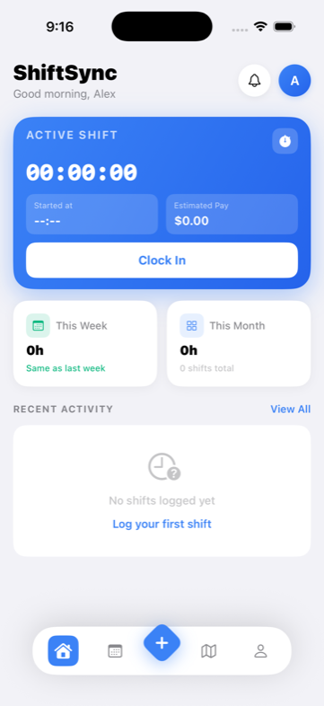

# ShiftSync

A shift tracking app for iOS and Apple Watch built with SwiftUI.

<p align="center">
  
</p>

## Features

- **Clock In / Out** — Start and stop shifts with one tap, synced to Apple Watch
- **Manual Entry** — Log shifts manually with full date, time, and type selection
- **Shift Types** — Regular, Overtime, Holiday (2x pay), Vacation, Sick, Formation, Company Fun Day
- **Pay Calculation** — Live earnings based on your hourly rate and overtime multiplier
- **Overtime Rules** — Auto-splits shifts into regular + overtime when daily threshold is exceeded
- **Work Day Hours** — Configurable hours per day used for all day-off pay calculations
- **Activity Feed** — Recent shifts with duration, pay, and shift type badges
- **Calendar View** — Monthly calendar showing days with logged shifts
- **Export Reports** — Export shift data by period (weekly, monthly, custom)
- **Workplace Geofencing** — Location-based arrival/departure notifications
- **Apple Watch App** — Clock in/out and view active shift directly from your wrist
- **Notifications** — Missed shift prompts with quick day-type logging
- **Dark Mode** — Full dark/light theme support

## Screen Support

Optimized for all iPhone sizes:

| Device | Screen | Notes |
|---|---|---|
| iPhone SE (2nd/3rd gen) | 375 × 667 pt | Proportional spacing, no overflow |
| iPhone 16 / 15 | 390 × 844 pt | Default target |
| iPhone 16 Pro Max / 15 Pro Max | 430 × 932 pt | Full layout, adaptive padding |

- Login screen uses proportional spacing via `GeometryReader` — fits without scrolling on SE
- Active shift timer and row text use `minimumScaleFactor` to prevent clipping
- Bottom scroll padding is safe-area-aware across all devices

## Requirements

- iOS 17+
- watchOS 10+ (for Watch app)
- Xcode 15+

## Getting Started

1. Clone the repo:
   ```bash
   git clone git@github.com:Alexmaster12345/ShiftSync-iOS.git
   ```
2. Open `ShiftSync/ShiftSync.xcodeproj` in Xcode
3. Select your target device or simulator
4. Build and run (`Cmd+R`)

## Settings

| Setting | Description |
|---|---|
| Salary & Currency | Hourly/monthly rate, currency, and work day hours in one screen |
| Payment Type | Hourly or monthly pay mode |
| Work Day Hours | Hours counted as one full day (affects day-off pay) |
| Overtime Rules | Toggle + daily threshold and multiplier (e.g. 1.5×) |
| Vacation Days | Annual allowance with used/remaining tracking |
| Workplace Location | Address used for geofence arrival/departure alerts |

## Built With

- SwiftUI
- WatchConnectivity (iPhone ↔ Watch sync)
- CoreLocation (geofencing)
- UserDefaults (persistence)

## License

MIT
